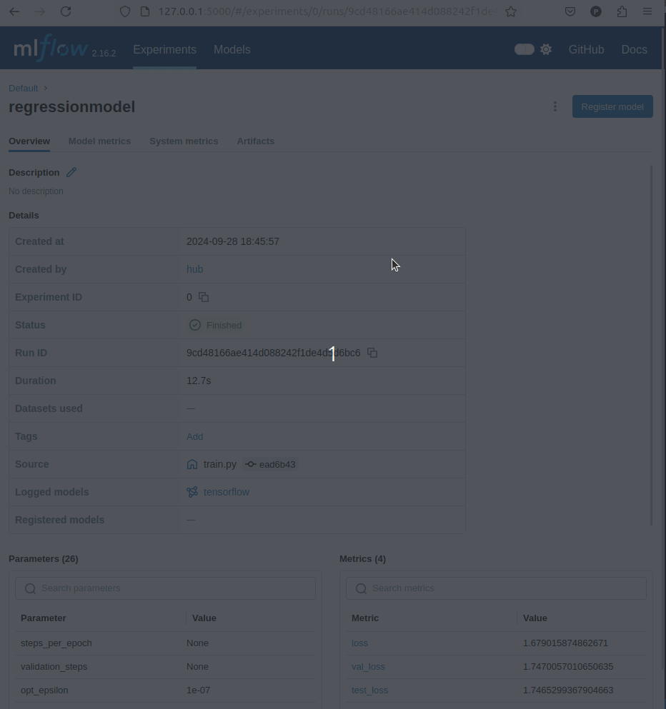
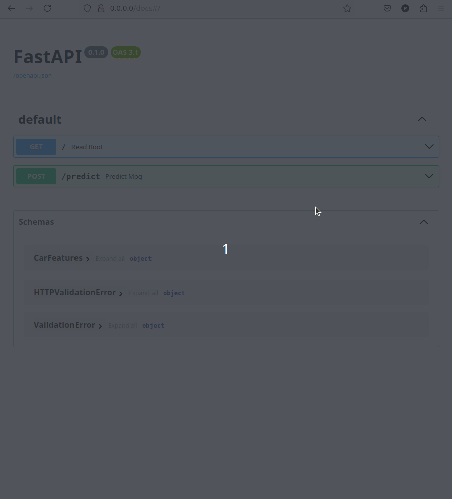
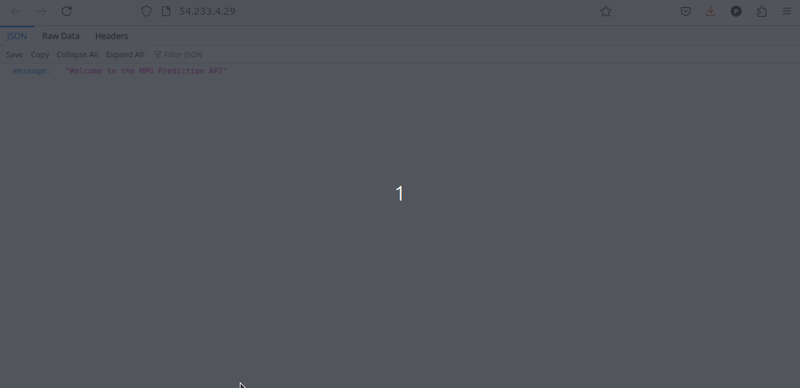

# MLOps Regression Project


## Objetivo
Eu resolvi desenvolver este projeto para fins de estudos em MLOps e apenas isso. A ideia foi reproduzir um tutorial da documentação oficial do TensorFlow implementando tecnologias de MLOps para o deploy de um modelo na nuvem. 


## 📈 Descrição do Projeto

Este projeto implementa um modelo de regressão para prever a eficiência de combustível (`MPG`) de automóveis dos anos 1970 e 1980, utilizando o clássico conjunto de dados **Auto MPG**. O objetivo é demonstrar como construir, treinar e implantar um modelo de aprendizado de máquina de ponta a ponta, integrando práticas de MLOps para garantir uma gestão eficiente de dados, experimentos e implantação.

## 📚 Contexto

Em um problema de regressão, o objetivo é prever o resultado de um valor contínuo, como um preço ou uma probabilidade. Em contraste, em um problema de classificação, o objetivo é selecionar uma classe a partir de uma lista de classes (por exemplo, determinar se uma imagem contém uma maçã ou uma laranja).

Este projeto utiliza o conjunto de dados [**Auto MPG**](https://archive.ics.uci.edu/dataset/9/auto+mpg) e demonstra como construir modelos para prever a eficiência de combustível de automóveis. Para isso, os modelos recebem uma descrição de diversos automóveis desse período, incluindo atributos como cilindros, deslocamento, potência (`horsepower`), peso, aceleração, ano do modelo e origem.

## 🛠️ Tecnologias Utilizadas

- **[DVC (Data Version Control)](https://dvc.org/):** Controle de versão dos dados, facilitando a reprodução de experimentos e garantindo a rastreabilidade das alterações nos dados.
- **[MLflow](https://mlflow.org/):** Rastreamento e registro de experimentos e modelos, permitindo o monitoramento eficiente do ciclo de vida do modelo.
- **[FastAPI](https://fastapi.tiangolo.com/):** Framework para servir o modelo como um serviço web de alta performance.
- **[Docker](https://www.docker.com/):** Containerização da aplicação, garantindo portabilidade e consistência entre ambientes de desenvolvimento e produção.
- **[AWS ECS (Elastic Container Service)](https://aws.amazon.com/ecs/):** Implantação do container na nuvem, permitindo escalar e gerenciar a aplicação de forma eficiente.

## 🚀 Estrutura do Repositório

```plaintext
.
├── data/
├── assets/
├── mlruns/
├── models/
│   └── dnn_model.keras
├── src/
│   ├── __init__.py
│   ├── data_ingestion.py
│   ├── data_preprocessing.py
│   ├── train.py
│   ├── evaluate.py
│   └── predict.py
├── app.py
├── LICENSE
├── requirements.txt
├── Dockerfile
├── .gitignore
└── README.md
```

## 📖 Descrição dos Arquivos Principais

- **`data/`**: Diretório onde os dados brutos e processados são armazenados.
- **`mlruns/`**: Diretório padrão do MLflow para armazenar informações de experimentos e modelos.
- **`models/dnn_model.keras`**: Modelo treinado salvo no formato Keras.
- **`src/`**: Diretório contendo os scripts Python para ingestão, pré-processamento, treinamento, avaliação e previsão de dados.
  - **`data_ingestion.py`**: Script para baixar e salvar os dados.
  - **`data_preprocessing.py`**: Script para pré-processar os dados.
  - **`train.py`**: Script para treinar o modelo de regressão.
- **`app.py`**: Aplicação FastAPI para servir o modelo como um serviço web.
- **`requirements.txt`**: Lista de dependências Python necessárias para o projeto.
- **`Dockerfile`**: Configuração para containerizar a aplicação usando Docker.
- **`.gitignore`**: Arquivo para especificar quais arquivos/diretórios devem ser ignorados pelo Git.
- **`README.md`**: Este arquivo de documentação.
- **`LICENSE`**: Licença do projeto.

## 🛠️ Como Executar o Projeto
1. Clonar o Repositório

```bash
git clone https://github.com/pedarias/MLOps-project-regression
cd seu-repo
```

2. Configurar o Ambiente de Desenvolvimento
a. Usando Docker

- Construir a Imagem Docker:

`sudo docker build -t mlops-regression-app .`

- Executar o Container Docker:

`sudo docker run -d -p 80:80 mlops-regression-app`

- Acessar a Aplicação:
Abra o navegador e vá para http://54.233.4.29 para ver a aplicação em execução.

> **Nota**: Pelo fato de eu ter criado uma conta 'Free Tier' na AWS, no momento em que você acessar o aplicativo pode não estar mais disponível na nuvem.

b. Sem Docker

- Criar um Ambiente Virtual:

```bash
python3 -m venv venv
source venv/bin/activate
```

- Instalar as Dependências:

```bash
pip install --upgrade pip
pip install -r requirements.txt
```

- Executar a Aplicação FastAPI:

`uvicorn app:app --host 0.0.0.0 --port 80`

- Acessar a Aplicação:

Abra o navegador e vá para http://0.0.0.0/docs para ver a aplicação com Swagger em execução.

3. Treinar o Modelo

- Ingestão de Dados:

`python src/data_ingestion.py`

- Pré-processamento de Dados:

`python src/data_preprocessing.py`

- Treinamento do Modelo:

`python src/train.py`

Este script também registra o experimento no MLflow e salva o modelo treinado em ``models/dnn_model.keras``.


4. Testar o Endpoint de Previsão

- Usando Swagger UI:

Acesse http://0.0.0.0/docs para utilizar a interface interativa do Swagger e testar o endpoint /predict.

- Usando cURL:

```bash

curl -X POST "http://seu-endereco-EC2/predict" \
     -H "Content-Type: application/json" \
     -d '{
           "Cylinders": 4,
           "Displacement": 120.0,
           "Horsepower": 95.0,
           "Weight": 2400.0,
           "Acceleration": 15.0,
           "Model_Year": 81,
           "USA": 1,
           "Europe": 0,
           "Japan": 0
         }'

    Resposta Esperada:

    json

        {
          "MPG": 30.5
        }
```



## 📦 Deploy na AWS ECS (Opcional)

### Visão Geral

Considerando que você está utilizando o AWS Free Tier, vamos implantar nossa aplicação em uma instância EC2. Por favor, note:

- **Suporte a GPU:** O AWS Free Tier não inclui instâncias com GPU. Se sua aplicação requer suporte a GPU, você precisará utilizar uma instância EC2 com GPU, o que acarretará custos adicionais.
- **Implantação CPU-Only:** Se sua aplicação puder rodar sem suporte a GPU, você pode implantá-la em uma instância elegível para o Free Tier (por exemplo, `t2.micro`).

### Opção 1: Implantação em uma Instância EC2 do Free Tier (Somente CPU)

#### Passo 1: Lançar uma Instância EC2

1. **Faça login no AWS Management Console:**
    - Acesse [AWS Management Console](https://console.aws.amazon.com/).

2. **Navegue até o Painel do EC2:**
    - Clique em **"Serviços"** no topo e selecione **"EC2"** em Compute.

3. **Clique em "Launch Instance":**
    - No Painel do EC2, clique em **"Launch Instance"**.

4. **Escolher uma Amazon Machine Image (AMI):**
    - Selecione **"Ubuntu Server 24.04 LTS (HVM), SSD Volume Type"** (64-bit x86).
    - Certifique-se de que a AMI é elegível para o Free Tier.

5. **Escolher um Tipo de Instância:**
    - Selecione `t2.micro` (elegível para o Free Tier).

6. **Configurar Detalhes da Instância:**
    - Aceite as configurações padrão ou ajuste conforme necessário.
    - Certifique-se de que **Auto-assign Public IP** está habilitado.

7. **Adicionar Armazenamento:**
    - O padrão de **8 GB** é suficiente, mas você pode aumentá-lo até 16 GB se necessário.

8. **Adicionar Tags (Opcional):**
    - Você pode etiquetar sua instância para identificação.

9. **Configurar Grupo de Segurança:**
    - Crie um novo grupo de segurança ou use um existente.
    - Adicione as seguintes regras de entrada:
        - **SSH (porta 22):** Seu endereço IP.
        - **HTTP (porta 80):** De qualquer lugar (`0.0.0.0/0`).

10. **Revisar e Lançar:**
    - Clique em **"Review and Launch"**.
    - Revise suas configurações e clique em **"Launch"**.
    - Selecione ou crie um novo par de chaves para acesso SSH.
    - Baixe o par de chaves e armazene-o com segurança.

#### Passo 2: Conectar-se à Sua Instância EC2

Use SSH para se conectar à sua instância:

```bash
chmod 400 /path/to/your/key.pem
ssh -i /path/to/your/key.pem ubuntu@your-instance-public-dns
```

#### Passo 3: **Na sua instância** EC2, instale o Docker:
```bash
# Atualizar listas de pacotes
sudo apt-get update

# Instalar pacotes pré-requisitos
sudo apt-get install -y apt-transport-https ca-certificates curl software-properties-common

# Adicionar a chave GPG oficial do Docker
curl -fsSL https://download.docker.com/linux/ubuntu/gpg | sudo apt-key add -

# Adicionar o repositório do Docker
sudo add-apt-repository "deb [arch=amd64] https://download.docker.com/linux/ubuntu focal stable"

# Instalar o Docker
sudo apt-get update
sudo apt-get install -y docker-ce

# Adicionar o usuário 'ubuntu' ao grupo 'docker' (opcional)
sudo usermod -aG docker ubuntu
```

#### Passo 4: Transferir Seu Código da Aplicação para a Instância EC2
Do seu computador local:
```bash
scp -i /path/to/your/key.pem -r /path/to/your/application ubuntu@your-instance-public-dns:/home/ubuntu/
```

#### Passo 5: Construir Sua Imagem Docker na Instância EC2
Navegue para o diretório da sua aplicação:

`cd /home/ubuntu/your-application-directory`

Construa a imagem:
`sudo docker build -t mlops-regression-app .`

#### Passo 6: Executar Seu Container Docker
Execute o container, mapeando a porta 80:
`sudo docker run -d -p 80:80 mlops-regression-app`

#### Passo 7: Testar Sua Aplicação
Do seu computador local, abra um navegador e navegue para:
`http://your-instance-public-dns`

Você deve ver o endpoint root da sua aplicação FastAPI!


## 🧰 Ferramentas de Controle de Versão e Monitoramento

- DVC (Data Version Control): Utilizado para versionar e gerenciar os dados do projeto, facilitando a reprodução de experimentos.
- MLflow: Ferramenta para rastreamento e registro de experimentos, permitindo monitorar o desempenho dos modelos ao longo do tempo.

## 📊 Modelo .keras
O modelo .keras (dnn_model.keras) é uma rede neural profunda construída e treinada usando o TensorFlow e Keras. Este modelo foi projetado para resolver um problema de regressão, onde o objetivo é prever a eficiência de combustível (MPG) de automóveis com base em atributos como cilindros, deslocamento, potência, peso, aceleração, ano do modelo e origem.

### 🧠 Estrutura do Modelo
- Camada de Normalização: Responsável por normalizar as entradas, garantindo que os dados estejam em uma escala adequada para o treinamento.
- Camadas Densas (Fully Connected): Duas camadas densas com 64 neurônios e função de ativação ReLU, seguidas por uma camada de saída com um único neurônio para a previsão contínua.
- Compilação: O modelo utiliza a função de perda de erro absoluto médio (mean_absolute_error) e o otimizador Adam com uma taxa de aprendizado de 0.001.

### 📄 Como o Modelo Foi Treinado
O treinamento do modelo foi realizado utilizando o script train.py, que segue os seguintes passos:

- Carregamento dos Dados: Os dados são carregados a partir dos arquivos CSV pré-processados.
- Separação de Features e Labels: As características (features) e os rótulos (labels) são separados para treinamento e teste.
- Normalização: Os dados são normalizados para melhorar a eficiência do treinamento.
- Configuração do MLflow: O MLflow é configurado para rastrear e registrar automaticamente os parâmetros, métricas e o modelo treinado.
- Treinamento do Modelo: O modelo é treinado por 100 épocas, com 20% dos dados reservados para validação.
- Avaliação do Modelo: O desempenho do modelo é avaliado utilizando o conjunto de teste, e a perda é registrada.
- Salvamento do Modelo: O modelo treinado é salvo no diretório models/ como um arquivo .keras.
- Registro no MLflow: As métricas de avaliação são logadas no MLflow para análise posterior.

## 🔗 Recursos Adicionais
Para mais informações sobre o processo de construção e treinamento de modelos de regressão com Keras e TensorFlow, consulte o [tutorial oficial do TensorFlow](https://www.tensorflow.org/tutorials/keras/regression) para mais informações.

## 📝 Contribuição
Contribuições são bem-vindas! Por favor, abra uma issue ou envie um pull request para melhorias ou correções.

## 📄 Licença
Esse projeto está licenciado sob a licença Apache. Veja o arquivo LICENSE para mais detalhes.

## 📫 Contato
Para mais informações ou dúvidas, entre em contato através do GitHub Issues ou me envie um e-mail.